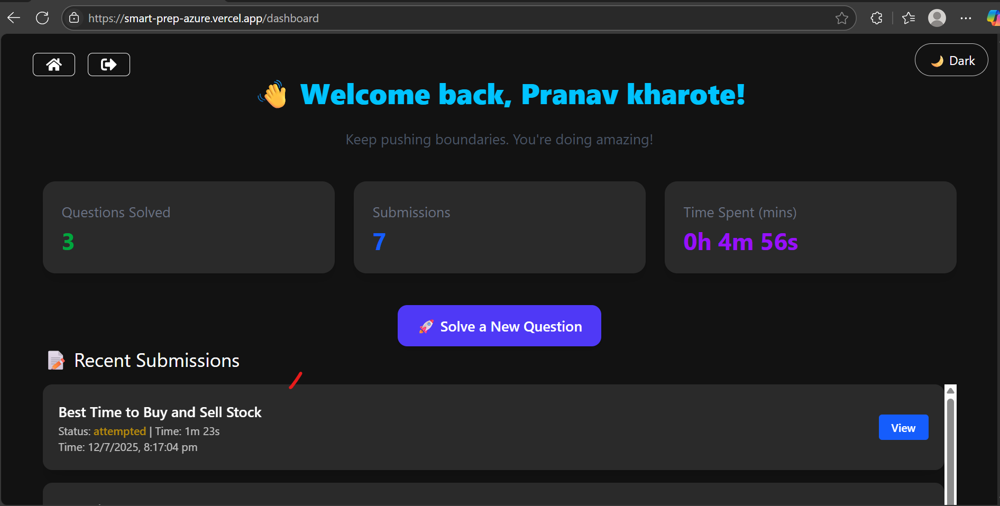
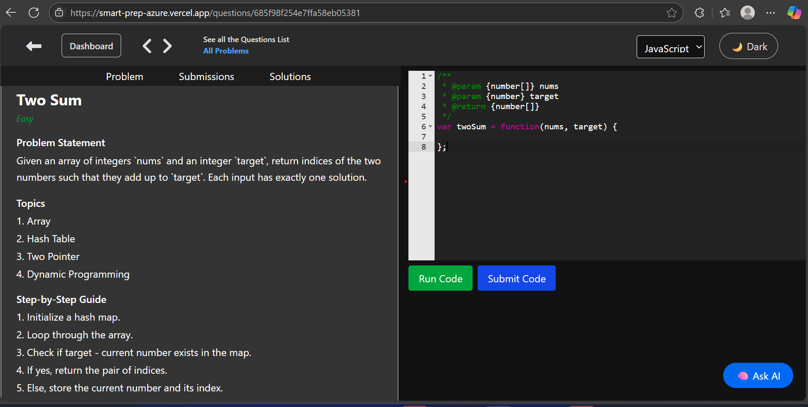
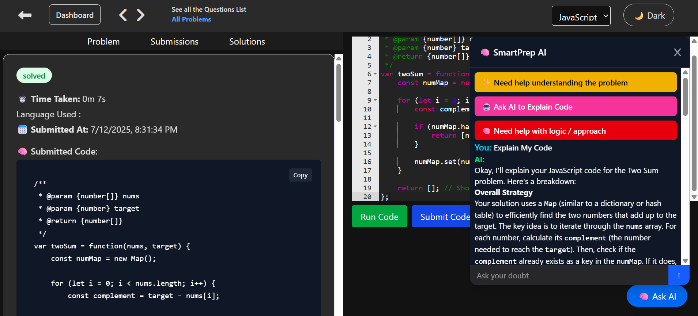

# 🚀 SmartPrep — Your Smart Coding Platform with Integreted AI Assistant

🌐 **Live Demo**: [smart-prep-azure.vercel.app](https://smart-prep-azure.vercel.app)

SmartPrep is a fully functional, multi-language coding practice platform that mimics real-world interview platforms like LeetCode and HackerRank — built with **MERN stack** and powered by **AI**-ready architecture.

> 👨‍💻 Practice coding questions  
> 📊 Track your submissions  
> 💡 Learn, grow & get job-ready — smarter!

---

## ✨ Features

- 🤖 **AI Assistance**
  - Explain Question Approaches
  - Explains User's Written code
  - AI chatbot
  - Reviews User's ode
- 🧠 **User Authentication**
  - Secure login/signup using JWT and cookies
  - Route protection for dashboard and submissions

- 🔐 **Protected Dashboard**
  - Personalized dashboard with:
    - Questions Solved
    - Submissions Made
    - Time Spent on Practice

- 💻 **Online Code Editor**
  - Language support: JavaScript, Python, Java, C++
  - Custom test case runner using **Piston API**

- 📥 **Smart Submission Tracking**
  - View recent submissions with status, time spent & timestamps
  - Track solution history per question

- 🌙 **Dark/Light Mode Toggle**
  - Fully responsive UI with theme switch support

- ⚙️ **Admin-Ready Backend**
  - Add/Delete questions
  - Role-based expansion possible

---

## 🧱 Tech Stack

| Tech         | Usage                         |
|--------------|-------------------------------|
| **React.js** | Frontend & UI Components      |
| **TailwindCSS** | Styling & Dark Mode         |
| **Node.js**  | Server-side runtime           |
| **Express.js** | Backend routing & API logic |
| **MongoDB**  | Database for users & questions|
| **JWT + Cookies** | Auth & protected routes |
| **Piston API** | Code execution & testing    |
| **Vercel**   | Frontend Deployment           |
| **Render**   | Backend Hosting               |

---

## 📸 Screenshots

> 🎯 Dashboard, SmartPrep AI, Editor

| Dashboard | Editor | SmartPrep AI |
|----------|--------|-------------|
|  |  |  |

---

## 🛠️ Local Setup Instructions

```bash
# 1. Clone the repo
git clone https://github.com/pranavkharote/smartPrep.git
cd smartprep

# 2. Backend setup
cd backend
npm install
# Create `.env` with Mongo URI & JWT_SECRET
nodemon server.js

# 3. Frontend setup
cd frontend
npm install
npm run dev
